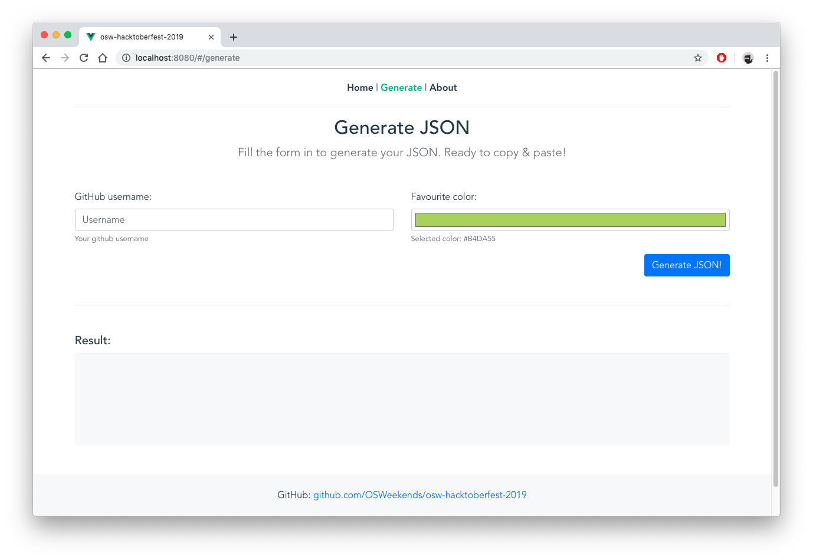

# 🔥 OSW Hacktoberfest 2019 🎃

[](https://img.shields.io/badge/code%20style-standard-brightgreen?style=flat-square)
[](https://github.com/OSWeekends/osw-hacktoberfest-2019/pulls)
[](https://github.com/OSWeekends/osw-hacktoberfest-2019/commits/master)
[](https://www.firsttimersonly.com/)

[](#contributors-)
[](https://github.com/OSWeekends/osw-hacktoberfest-2019/blob/master/CODE_OF_CONDUCT.md)


> Contribute by adding yourself to the [`contributors.json`](https://github.com/OSWeekends/osw-hacktoberfest-2019/blob/master/src/assets/contributors.json) file.  
> Go to the [__generate__](https://osw-hacktoberfest19.netlify.com/#/generate) page and fill the form in to get your data, then paste your copied code at the end of the file 🥳




__Congrats!__ You are an awesome contributor! 🎃 🎃 🎃

## Project setup
```
npm install
```

### Compiles and hot-reloads for development
```
npm run serve
```

### Compiles and minifies for production
```
npm run build
```

### Run your tests
```
npm run test
```

### Lints and fixes files
```
npm run lint
```

### Run your end-to-end tests
```
npm run test:e2e
```

### Run your unit tests
```
npm run test:unit
```


## Contributors ✨

Thanks goes to these wonderful people ([emoji key](https://allcontributors.org/docs/en/emoji-key)):

<!-- ALL-CONTRIBUTORS-LIST:START - Do not remove or modify this section -->
<!-- prettier-ignore -->
<table>
  <tr>
    <td align="center"><a href="https://twitter.com/baumannzone"><br /><sub><b>Jorge Baumann</b></sub></a><br /><a href="https://github.com/OSWeekends/osw-hacktoberfest-2019/commits?author=baumannzone" title="Code">💻</a> <a href="#example-baumannzone" title="Examples">💡</a> <a href="#content-baumannzone" title="Content">🖋</a> <a href="#infra-baumannzone" title="Infrastructure (Hosting, Build-Tools, etc)">🚇</a></td>
    <td align="center"><a href="https://github.com/CodingCarlos"><br /><sub><b>Carlos Hernandez</b></sub></a><br /><a href="#example-CodingCarlos" title="Examples">💡</a> <a href="#ideas-CodingCarlos" title="Ideas, Planning, & Feedback">🤔</a></td>
    <td align="center"><a href="https://github.com/PseudoNerd"><br /><sub><b>Tanmay Kumar</b></sub></a><br /><a href="https://github.com/OSWeekends/osw-hacktoberfest-2019/commits?author=PseudoNerd" title="Code">💻</a></td>
    <td align="center"><a href="http://agusnez.github.io"><br /><sub><b>Agustín Núñez</b></sub></a><br /><a href="https://github.com/OSWeekends/osw-hacktoberfest-2019/commits?author=Agusnez" title="Code">💻</a></td>
  </tr>
</table>

<!-- ALL-CONTRIBUTORS-LIST:END -->

This project follows the [all-contributors](https://github.com/all-contributors/all-contributors) specification. Contributions of any kind welcome!
